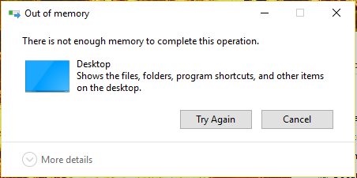

# Memory management using Smart Pointers in C++ - Part 1

One of the major strengths and weaknesses of both C and C++ are pointers. C++ has many benefits of pointers but also several pitfalls if memory management is not performed correctly. Pointers require explicit management of the resources to which they refer.  For example, a pointer that holds the address of dynamically allocated memory retrieved using `new` requires the programmer to release that memory using `delete`; failing to do so results in dangling pointers or memory leaks which are difficult to find.

A smart pointer provides a mechanism that automates the explicit management of a resource. A smart pointer, as opposed to a raw pointer, can manage the memory of the resource to which it points. It is a proxy for a raw pointer to the resource, and it looks and feels like a raw pointer. It supports the dereferencing `(*)` and member by pointer `(->)` operators. A smart pointer resides on the stack; when it goes out of scope, its destructor deallocates the dynamic memory to which it points to. 

Smart pointers implement the object-oriented language idiom Resource Acquisition Is Initialization ([RAII](https://en.cppreference.com/w/cpp/language/raii)). This idiom states that the resource is acquired at initialization time, i.e, when the memory for the pointer is created.

### Why should we use Smart Pointers?

Let’s look at this very simple piece of code that causes a memory leak.

```C++
int main()
{
    int *ptr = new int[20];

    // Oops forgot to delete ptr
    return 0;
}
```
When I use [Valgrind](https://valgrind.org/) to check the binary for memory leaks; I got the following results.

```bash
==1562402== LEAK SUMMARY:
==1562402==    definitely lost: 80 bytes in 1 blocks
==1562402==    indirectly lost: 0 bytes in 0 blocks
==1562402==      possibly lost: 0 bytes in 0 blocks
==1562402==    still reachable: 0 bytes in 0 blocks
==1562402==         suppressed: 0 bytes in 0 blocks
==1562402==
==1562402== For lists of detected and suppressed errors, rerun with: -s
==1562402== ERROR SUMMARY: 1 errors from 1 contexts (suppressed: 0 from 0)
```
You can clearly see that we leaked 80 bytes (4 bytes x 20) of memory because we did not run `delete` on `ptr` and it is quit difficult to manually keep track of all allocations and `delete` them at the right time; especially when we have sufficiently large C++ project where objects are copied, moved and passed everywhere in the code.

Let's look at another scenario of memory leak using raw pointers

```C++
void someFunction()
{
     MyClass *obj = new MyClass(10);
     if (!Validate(obj))
     {
	return; // memory leak
     }

     // ....

     obj->someOtherFunction();
     delete obj;
}
```
Assuming the function `someFunction()` is getting called infinite times and the `obj` validation fails every time. This leads to the situations when programmers keep allocating new memory and do not lose any pointers to it, but keep pointers to objects that the program is not going to use anymore (dangling pointer). This is not formally a memory leak but leads to the same situation: *a program running out of memory*



Even if we use `new` and `delete` pairs correctly we may encounter a scenario of memory leak. Lets look at the below example.

```C++
void SomeMethod()
{
   MyClass *obj = new MyClass;
   SomeOtherMethod();      // it can throw an exception
   delete obj;
}
```
If an exception is thrown, the `obj` object is never deleted. No matter how much we try, it is very difficult to free all dynamically allocated memory. Even if we can do that, it is often not safe from exceptions.

**Deleting an Array With `delete`** 
Creating temporary arrays of dynamic size is often necessary. After they are not required anymore, it is important to free the allocated memory. The C++ requires special `delete` operator with `[]` brackets, which is forgotten very easily. The `delete[]` operator call destructors of all objects from an array along with deleting the memory allocated for an array. It is also incorrect to use the `delete` operator without `[]` brackets for an array, which results in undefined behaviour.

#### We should avoid using heap memory as much as possible
And for these reasons, modern C++ avoids using heap memory as much as possible by declaring objects on the stack; when a resource-owning stack object goes out of scope, its destructor is automatically invoked.

The following example shows a simple object `e`. It is declared on the stack at function scope, and is destroyed at the end of the function block. The object `e` owns no resources (such as heap-allocated memory) and hence no special code is needed in the `Entity` destructor.

```C++
class Entity
{
private:
    int* data;
public:
    explicit Entity(const int size) { data = new int[size]; } // acquire
    ~Entity() { delete[] data; } // release
    void do_something() {}
};

void functionUsingEntity() {
    Entity e(100);   // lifetime automatically tied to enclosing scope
                        
    e.do_something();

} // automatic destruction and deallocation for e
```

Since C++11, there is a better way to write the previous example: by using a smart pointer from the standard library. The smart pointer manages the allocation and deletion of memory that it owns. The use of a smart pointer eliminates the need for an explicit destructor in the `Entity` class.

### Types of Smart Pointers
There are 3 types of smart pointers:
1. Unique Pointer (`std::unique_ptr<>`)
   - Exclusive ownership
   - Lightweight pointers
   - Destroys the object when goes out of scope

2. Shared Pointer (`std::shared_ptr<>`)
   - Shared ownership
   - Destroys the object when last reference is released
3. Weak Pointer (`std::weak_ptr<>`)
   - Breaks cyclic references
   - used with `shared_ptr` 

> **_NOTE:_**  auto pointer (`std::auto_ptr`) has been depreciated after the inclusion of move semantics in C++11. 

### Unique Pointers (`std::unique_ptr<>`)

With a `unique_ptr`, you can point to an allocated object, and when the `unique_ptr` goes out of scope, the pointed-to object gets deleted,and this happens regardless of how we leave the function, either by a return or an exception being thrown somewhere. 
For example:

```C++
void functionWithUniquePointer()
{
    std::unique_ptr<MyClass> ptr(new MyClass); // ptr owns the MyClass resource
    ptr->do_something();		       // tell the object to do something
    do_somethingelse();			       // might throw an exception
} // ptr gets destroyed; destructor deletes the MyClass object resource
```
#### using `unique_ptr` like a raw pointers

Since the dereferencing `(*)` and member by pointer `(->)` operators are overloaded in `unique_ptr` class, we can use `unique_ptr` as

```C++
up->do_something(); // used arrow operator similar to raw pointers
(*up).do_something(); // used dereferencing operator similar to raw pointers
```
We can also check the null-ness of the pointer similar to raw pointers as

```C++
if(up)
if(up.get() != nullptr)
if(up == nullptr)
```
Freeing the memory sets the `unique_ptr` to `nullptr`

```C++
up == nullptr
up.reset()
```

#### Exclusive ownership of object for `unique_ptr`

To be the only owner of a resource means that only the respective `unique_ptr` pointers are responsible for deleting the object when it is no longer needed (i.e, responsible about the lifetime of the object). This implies that nobody else can use the object after its lifetime ended and for the same reason the `std::unique_ptr` has practically no overhead and has very predictable behavior.

Since `unique_ptr` maintains sole ownership of the resource, one can not make a copy of it and for the type safety reasons the copy constructor and copy assignment operators are deleted. Instead we can transfer/move ownership of the pointer from the one pointer object to another using **move semantics**.

```C++
std::unique_ptr<Thing> p1 (new Thing); // p1 owns the Thing
std::unique_ptr<Thing> p2(p1); // error - copy construction is not allowed.
std::unique_ptr<Thing> p3; // an empty unique_ptr;
p3 = p1; // error, copy assignment is not allowed.

std::unique_ptr<Thing> up1;
std::unique_ptr<Thing> up2(new Thing);
up1 = std::move(up2); // ownership transfer using move semantics is allowed
```
##### Passing `std::unique_ptr` as function argument

A `unique_ptr` has to be moved while passing it to a function that takes a `unique_ptr` by value.

```C++
void foo(std::unique_ptr<std::string> cp) {
 //...
}

//call foo

auto up = std::make_unique<std::string>("some string");

foo(up); //!ERROR. No copy allowed.

foo(std::move(up)); //OK. Explicit move

foo(std::make_unique<std::string>("some string")); //OK. Implicit move
```
### Using `std::unique_ptr` with Standard Containers

We can fill a Standard Container with `unique_ptr`s that own objects, and the ownership then effectively resides in the container.

- You must fill the container by supplying *rvalue* `unique_ptr`s, so the ownership transfers into the
`unique_ptr` in the container

- If you erase an item in the container, you are destroying the `unique_ptr`.
- If you transfer ownership out of container items, the empty `unique_ptr`s stay in the container.

### Custom deleters for `std::unique_ptr`
The complete type of `std::unique_ptr` has a second template parameter, its deleter that has a default type `std::default_delete<T>`

```C++
template< class T, class Deleter = std::default_delete<T> > 
class unique_ptr;
```
A `unique_ptr` can be declared and initialized with a user-provided custom deleter that is called to destroy the object resource.

```C++
template <typename T>
class CustomDeleter
{
public:
    void operator()(T* ptr) const {
        std::cout << "freeing memory using 'delete'...\n";
        delete ptr;
    }
};

template <typename T>
class CustomDeleter<T[]>
{
public:
    template <typename U>
    void operator()(U* ptr) const {
        std::cout << "freeing memory using 'delete[]'...\n";
        delete[] ptr;
    }
};

int main()
{
   
    int* p = new int{0};
    int* p2 = new int[3]{5, 7, 8};
    std::unique_ptr<int, CustomDeleter<int>> upi(p, CustomDeleter<int>{}); // using unique_ptr with raw pointer is discouraged
    std::unique_ptr<int[], CustomDeleter<int[]>> upari(p2, CustomDeleter<int[]>{});
    return 0;
}
```
 CustomDeleter is passed as an argument to constructor and stored as a member of a `unique_ptr` object. A deleter can be a function object, a function pointer, or a Lambda. The above example uses function object as second parameter.

Very simple example for customer deleter using function pointer.

```C++
void deleter(int* ptr)
{
     std::cout << "Function pointer deleter\n" << std::endl;
     delete ptr;
}

int main()
{
     std::unique_ptr<int, void(*)(int*)> up_fptr(new int, deleter);
     return 0;
}
```
custom deleter using lambda

```C++
int main()
{
     // With a capture-less lambda. 
     auto l = [](int* p) {
	    std::cout << "Lambda deleter\n";
	    delete p;
	};
     std::unique_ptr<int, decltype(l)> up_lambda(new int, l);
     return 0;
}
```
The most common use of `unique_ptr` is as a pretty fool-proof way of making sure an object allocated in function gets deleted. However, there are situations in which ownership of objects needs to be transferred around but always remains in one place at a time; `unique_ptr` gives you way to represent this concept directly.

### What's Next?

In the next article, I will write about `std::shared_ptr` and `std::weak_ptr` in detail; also, I will talk about these smart pointers in terms of performance.


