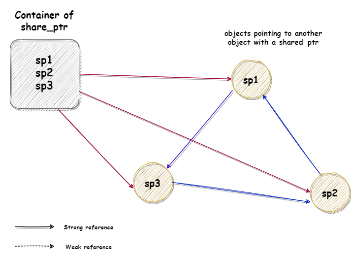
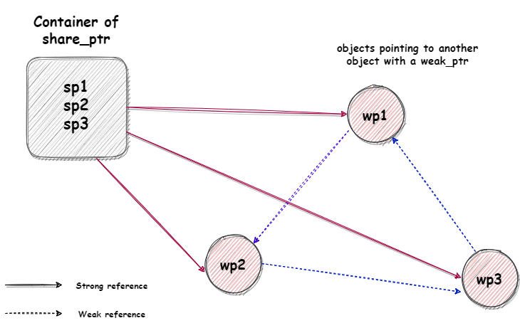

# Memory management using Smart Pointers in C++ - Part 2

In the previous article on *Memory management using smart pointers* (Part 1), we saw that `unique_ptr` implements unique ownership - only one smart pointer owns the object at a time. But there might be scenarios where you might need to create multiple pointers of the same object and **share** them; in that case we should use shared pointer(`std::shared_ptr`). One such scenario could be - using smart pointers for multithreading; sharing a pointers between threads helps to keep the smart pointer alive within threads when other thread using the same smart pointer goes out of scope (i.e, more than one owner manages the lifetime of the object in memory).

### Shared Pointers (`std::shared_ptr<>`)

`std::shared_ptr` is a smart pointer that retains **shared ownership** of an object through a pointer. The same object may be owned by multiple `shared_ptr` objects. The object is destroyed and its memory deallocated when either of the following happens:

- the last remaining `shared_ptr` owning the object is destroyed.
- the last remaining `shared_ptr` owning the object is assigned another pointer via `operator=` or `reset()`.

Shared pointers keep something called a **reference count**; which keeps track of the number of pointers to an object (manager object to be specific). As we create more copies of the pointer and they exit scope, the reference count is incremented and decremented accordingly. Finally, when the reference count reaches zero, the underlying memory is freed.

```C++
int main()
{
    std::shared_ptr<int> sp1 = std::make_shared<int>(2);
    std::cout << sp1.use_count() << '\n';   // prints 1
 
    {
        std::shared_ptr<int> sp2 = sp1;  // object copy -> reference count increments to 2
        std::cout << sp1.use_count() << '\n'; // prints 2
    } // sp2 goes out of scope hence reference count decrements to 1
 
    std::cout << sp1.use_count() << '\n'; // prints 1

    return EXIT_SUCCESS;
} // reference count reaches zero as sp1 goes out of scope; hence object resource is destroyed
```

#### How shared pointer works internally?

When the managed object is dynamically allocated using `shared_ptr`, the first `shared_ptr` object (lets call it `sp1`) contains two raw pointers, one pointing to the managed object (returned by `get()`) and another raw pointer pointing to the control block (also called as manager object). The control block contains a pointer to the managed object, two reference counts (the number of `shared_ptr`s pointing to the manager object and the number of `weak_ptr`s pointing to the manager object) and depending on how a `shared_ptr` is initialized, it can also contain other data, such as a *deleter* and an *allocator*.


 
The `shared_ptr` constructor creates a manager object (dynamically allocated) and  the overloaded member functions like `shared_ptr::operator->` access the pointer in the manager object to get the actual pointer to the managed object. If another `shared_ptr` (`sp2`) is created by copy or assignment from `sp1`, then it also points to the same manager object, and the copy constructor or assignment operator increments the shared count to show that 2 `shared_ptr`s are now pointing to the managed object.

Similarly, when weak pointer is created by copy or assignment from the `shared_ptr` object or another `weak_ptr` object, it points to the same manager object and the weak pointer count is incremented. When `sp1` and the manager object are first created, the shared count will be 1, and the weak count will be 0

##### Virtual destructor and `shared_ptr`

The manager object (or control block) contains pointer to the managed object, which is basically used for deleting the object. One interesting fact is that the managed pointer in the manager object may be of a different type (and even have a different value) than the raw pointer in the `shared_ptr`; that's because `shared_ptr` stores type-erased deleter in the manager object.

```C++
// A shared_ptr<void> managing double
// The raw pointer is void*
// Managed pointer in the manager object is double*
auto sp = std::shared_ptr<void>(new double()); //OK
```
This leads to an interesting use case where we can avoid incomplete deletion of derived object when derived object pointer is assigned to a base class pointer (of course without virtual destructor). Lets look at an example for incomplete deletion of an object.

```C++
struct Base
{
    ~Base()
    {
        std::cout << "Base::~Base()\n";
    }
};


struct Derived: public Base
{
    ~Derived()
    {
        std::cout << "Derived::~Derived()\n";
    }
};

int main()
{
    Base* base = new Derived;
    delete base; // prints Base::~Base(), hence Derived class object is partially destructed
    return EXIT_SUCCESS;
}
```
Of course the fix for the issue is doing the binding at run time polymorphically (dynamic binding) i.e, using virtual destructor in the base class, which prints

```
Derived::~Derived()
Base::~Base()
```
If we use `shared_ptr` we may not need virtual destructor since the smart pointer will take care of it for us. Changing the above code with `shared_ptr`

```C++
struct Base
{
    ~Base()
    {
        std::cout << "Base::~Base()\n";
    }
};


struct Derived: public Base
{
    ~Derived()
    {
        std::cout << "Derived::~Derived()\n";
    }
};

int main()
{
    std::shared_ptr<Base> base(new Derived);
    return EXIT_SUCCESS;
}

/*
prints
Derived::~Derived()
Base::~Base()
*/
```
In the above code, despite the destructor not being virtual, the correct derived class (`Derived`) destructor is invoked when the base class (`Base`) `shared_ptr` goes out of scope or reset. This works because the manager object (control block) is destroying the object through `Derived*` deleter and not through the raw pointer `Base*`. However, the destructor should be declared `virtual` in the base class to make it operate polymorphically; the above example is just to show how `shared_ptr` works.

> **_NOTE:_** `unique_ptr<Base> base(new Derived)` do not provide this feature because with `unique_ptr` deleter function is part of the type and there is no concept of control block or manager object.

### Using `shared_ptr`

To use `shared_ptr`like a raw pointer the arrow operator(`->`) and dereferencing (`*`) operator are overloaded.

```C++
sp->myMethod();
(*sp)->myMethod();
```
You can call a `reset()` member function, which will decrement the reference count and delete the pointed-to object if appropriate, and result in an empty `shared_ptr` that is just like a default-constructed one. You can also reset a `shared_ptr` by assigning it the value `nullptr.

```C++
sp.reset();
sp = nullptr;
```

Below is a code sketch to illustrate the basic usage

```C++
class MyClass
{
public:
    void classMethod();
};
ostream &operator<<(ostream &, const MyClass &);
// ...

// a function can return a shared_ptr
std::shared_ptr<MyClass> find_some_thing();

// a function can take a shared_ptr parameter by value;
std::shared_ptr<MyClass> do_something_with(std::shared_ptr<MyClass> p);

void foo()
{
    // the new is in the shared_ptr constructor expression:
    std::shared_ptr<MyClass> sp1(new MyClass);
   // ... 
    std::shared_ptr<MyClass> sp2 = sp1;       // sp1 and sp2 now share ownership of the MyClass
   // ... 
    std::shared_ptr<MyClass> p3(new MyClass); // another MyClass
    sp1 = find_some_thing();              // sp1 may no longer point to first MyClass
    do_something_with(sp2);
    sp3->classMethod();  // call a member function like built-in pointer
    cout << *sp2 << endl; // dereference like built-in pointer
    // reset with a member function or assignment to nullptr:
    sp1.reset();   // decrement count, delete if last
    sp2 = nullptr; // convert nullptr to an empty shared_ptr, and decrement count;
}
// sp1, sp2, sp3 go out of scope, decrementing count, delete the MyClass if last
```
#### Casting `shared_ptr`

Having two classes one that inherits from another, when trying to assign a smart pointer variable of the derived class to a smart pointer variable of the base class it is required to use `std::static_pointer_cast` in place of the normal `static_cast` (used with raw pointers). It will be useful to remove the suggestion to use the `static_cast` and include the suggestion to use the `std::static_pointer_cast`.

For example:

```C++

#include <memory>
#include <iostream>
 
class Base{
 public:
    Base(){std::cout << "Base::Base()" << std::endl;}
    ~Base(){std::cout << "Base::~Base()" << std::endl;}
    void print(){std::cout << "Base::print()" << std::endl;}
};
 
class Derived:public Base{
 public:
    Derived(){std::cout << "Derived::Derived()" << std::endl;}
    ~Derived(){std::cout << "Derived::~Derived()" << std::endl;}
    void print(){std::cout << "Derived::print()" << std::endl;}
};
 
int main()
{
    std::shared_ptr<Base> b_ptr = std::make_shared<Derived>();
    b_ptr->print();
    auto d_ptr = std::static_pointer_cast<Derived>(b_ptr);
    d_ptr->print();
    return EXIT_SUCCESS;
}
  

/* OUTPUT
Base::Base()
Derived::Derived()
Base::print()
Derived::print()
Derived::~Derived()
Base::~Base()
*/
```

#### Getting better memory allocation performance from `shared_ptr`

When we create an object with `new` operator in `shared_ptr` there will be two dynamic memory allocations that happen, one for object from the `new` and the second is the manager object created by the `shared_ptr` constructor. Since memory allocations are slow, creating `shared_ptr` is slow when compared to raw pointer. To solve this problem C++11 has introduced the function template `make_shared` that does a single memory allocation big enough to hold both manager object and the `new` object, with the constructor parameters passed, which returns a `shared_ptr` of required type.

```C++
std::shared_ptr<MyClass> sp(new MyClass("some string")) // Bad practice - two allocations
std::shared_ptr<MyClass> sp(std::make_shared<MyClass>("some string")); // Good practice - one allocation
```
Using `make_shared` also avoids explicit use of `new`, promoted in the slogan "[no naked new!](https://andrewshitov.com/2019/11/11/avoiding-naked-new-in-modern-cpp/)". Because only a single memory allocation is involved when you use `make_shared` to initialize a `shared_ptr`, you can expect improved performance over the separate allocation approach.

### Getting `std::shared_ptr` from `this`  Object

In the situation where the class member function needs to pass a pointer to `this` object to another function that accepts the `shared_ptr` to that class object as argument then we can use `std::enable_shared_from_this` to create an object that returns `shared_ptr` from `this`. Hence the class of the objects has to be derived from `std::enable_shared_from_this`, which unlocks the special method `shared_from_this`, which can be used to create `shared_ptr` from `this`.

```C++
#include <iostream>
#include <memory>

class MyClass;

void someFunction(std::shared_ptr<MyClass> shareMe)
{
    std::cout << "someFunction: shareMe.use_count(): " << shareMe.use_count() << std::endl;
}

class MyClass : public std::enable_shared_from_this<MyClass>
{
public:
    std::shared_ptr<MyClass> getShared()
    {
        return shared_from_this();
    }
    void classMethod()
    {
        //....
        someFunction(getShared());
        //....
    }
};

int main()
{
    std::cout << std::endl;

    std::shared_ptr<MyClass> shareMe(new MyClass);
    std::shared_ptr<MyClass> shareMe1 = shareMe->getShared();
    {
        auto shareMe2(shareMe1);
        std::cout << "main(): shareMe.use_count(): " << shareMe.use_count() << std::endl;
    }
    std::cout << "main(): shareMe.use_count(): " << shareMe.use_count() << std::endl;

    shareMe1.reset();

    std::cout << "main(): shareMe.use_count(): " << shareMe.use_count() << std::endl;

    shareMe->classMethod();

    std::cout << std::endl;
    return EXIT_SUCCESS;
}
```
#### `std::shared_ptr` as function argument

From performance perspective taking `shared_ptr` by copy or by reference make significant difference. 

```C++
void functionbyReference(std::shared_ptr<int> &refPtr)
{
    std::cout << "refPtr.use_count(): " << refPtr.use_count() << std::endl;// prints 1
}

void functionbyCopy(std::shared_ptr<int> cpyPtr)
{
    std::cout << "cpyPtr.use_count(): " << cpyPtr.use_count() << std::endl; // prints 2
}

int main()
{

    auto sp(std::make_shared<int>(2021));
    std::cout << "sp.use_count(): " << sp.use_count() << std::endl; // prints 1

    functionbyReference(sp);
    functionbyCopy(sp);

    std::cout << "sp.use_count(): " << sp.use_count() << std::endl; // prints 1
    return EXIT_SUCCESS;
}
```

The reference count is incremented a when function takes `shared_ptr` by copy; since incrementing and decrementing the reference count is an expensive operation and hence results in a performance difference. The quick [benchmark test](https://quick-bench.com/q/6HlGvXHREhCsNr0hulCgZ-padiQ) states the measurable difference in performance (almost twice).


### Cyclic reference problem with `shared_ptr`

The problem with `shared_ptr` is that if there is a ring, or cycle of an objects that have `shared_ptr` to each other, they keep each other alive - they won't get deleted as they are holding each other (i.e, still has a `shared_ptr` pointing to them) leading to memory leak.

```C++
//Forward declaration
struct MyClass2;
struct MyClass3;

struct MyClass1 {     
 std::shared_ptr<MyClass3> sp3;
};

struct MyClass2 {
 std::shared_ptr<MyClass1> sp1;
};

struct MyClass3 {
 std::shared_ptr<MyClass2> sp2;
};
```



Lets look at an example that causes cyclic reference problem

```C++
#include <memory>
#include <iostream>

struct MyClassB;
struct MyClassA
{
    std::shared_ptr<MyClassB> b;
    ~MyClassA() { std::cout << "MyClassA::~MyClassA()\n"; }
};

struct MyClassB
{
    std::shared_ptr<MyClassA> a;
    ~MyClassB() { std::cout << "MyClassB::~MyClassB()\n"; }
};

void useClassAnClassB()
{
    auto a = std::make_shared<MyClassA>();
    auto b = std::make_shared<MyClassB>();
    a->b = b;
    b->a = a;
}

int main()
{
    useClassAnClassB();
    std::cout << "Finished using A and B\n";
}

/*OUTPUT
Finished using A and B
*/
```
If both references are `shared_ptr` then that says `MyClassA` has ownership of `MyClassB` and `MyClassB` has ownership of `MyClassA`, which should ring alarm bells. In other words, `MyClassA` keeps `MyClassB` alive and `MyClassB` keeps `MyClassA` alive.

In this example the instances `a` and `b` are only used in the `useClassAnClassB()` function so we would like them to be destroyed when the function ends but as we can see when we run the program the destructors are not called.

The memory leak summary is as shown below.

``` bash
==1969133==
==1969133== LEAK SUMMARY:
==1969133==    definitely lost: 32 bytes in 1 blocks
==1969133==    indirectly lost: 32 bytes in 1 blocks
==1969133==      possibly lost: 0 bytes in 0 blocks
==1969133==    still reachable: 0 bytes in 0 blocks
==1969133==         suppressed: 0 bytes in 0 blocks
==1969133==
==1969133== For lists of detected and suppressed errors, rerun with: -s
==1969133== ERROR SUMMARY: 1 errors from 1 contexts (suppressed: 0 from 0)
```

C++11 includes a solution: **weak** smart pointers: these only **observe** an object but do not influence its lifetime. 

### Weak pointer `std::weak_ptr<>`

A ring of objects can point to each other with `weak_ptrs`, which point to the managed object but do not keep it in existence. This is shown in the diagram below, where the "observing" relations are shown by the dotted arrows. 



If the shared pointer container is emptied, the three objects in the ring are automatically deleted because no other shared pointers point to them; weak pointers, like raw pointers, do not keep the pointed-to object "alive" and hence cycle problem has been resolved.

**Solution to the problem**
The solution to the cyclic reference problem example is to decide who owns who. Lets say `MyClassA` owns `MyClassB` but `MyClassB` does not own `MyClassA` then we replace the reference to `MyClassA` in `MyClassB` with a `weak_ptr` like 

```C++
#include <memory>
#include <iostream>

struct MyClassB;
struct MyClassA
{
    std::shared_ptr<MyClassB> b;
    ~MyClassA() { std::cout << "MyClassA::~MyClassA()\n"; }
};

struct MyClassB
{
    std::weak_ptr<MyClassA> a;
    ~MyClassB() { std::cout << "MyClassB::~MyClassB()\n"; }
};

void useMyClassAnMyClassB()
{
    auto a = std::make_shared<MyClassA>();
    auto b = std::make_shared<MyClassB>();
    a->b = b;
    b->a = a;
}

int main()
{
    useMyClassAnMyClassB();
    std::cout << "Finished using A and B\n";
}

/*OUTPUT
MyClassA::~MyClassA()
MyClassB::~MyClassB()
Finished using A and B
*/
```
Then if we run the program we see that `a` and `b` are destroyed as we expect. And memory leak summary (for the above code) below shows that, no memory is leaked and the objects are destroyed gracefully.

```bash
==1969207== HEAP SUMMARY:
==1969207==     in use at exit: 0 bytes in 0 blocks
==1969207==   total heap usage: 4 allocs, 4 frees, 73,792 bytes allocated
==1969207==
==1969207== All heap blocks were freed -- no leaks are possible
==1969207==
==1969207== For lists of detected and suppressed errors, rerun with: -s
==1969207== ERROR SUMMARY: 0 errors from 0 contexts (suppressed: 0 from 0)
```


The definition of weak_ptr is designed to make it relatively foolproof, so as a result there is very little you can do directly with a `weak_ptr`. For instance, you can't dereference it; neither `operator*` nor `operator->` is defined for a `weak_ptr`, you can not get pointer to an object - there is no `get()` function.

#### Using `weak_ptr`

During initialization, the `weak_ptr` is constructed as empty; the `weak_ptr` object can only be initialized by copy or assignment from the `shared_ptr` or an existing `weak_ptr` to the object.

```C++
std::shared_ptr<MyClass> sp(new Thing);
std::weak_ptr<MyClass> wp1(sp); // construct wp1 from a shared_ptr
std::weak_ptr<MyClass> wp2; // an empty weak_ptr - points to nothing
wp2 = sp; // wp2 now points to the new MyClass
std::weak_ptr<MyClass> wp3 (wp2); // construct wp3 from a weak_ptr
std::weak_ptr<MyClass> wp4
wp4 = wp2; // wp4 now points to the new MyClass.
```

You can not refer to an object directly using `weak_ptr`; you have to get a `shared_ptr` from it with `lock()` member function.

```C++
std::shared_ptr<MyClass> sp2 = wp2.lock(); // get shared_ptr from weak_ptr
```
The `lock()` function checks the state of the manager object to see if the managed object still exists. if it does not exist, returns an empty `shared_ptr` and if managed object exists, it returns a `shared_ptr` to the manager object.

```C++
std::shared_ptr<MyClass> sp = wp.lock(); // get shared_ptr from weak_ptr
if(sp)
    sp->do_something(); // tell the MyClass to do something
else
    std::cout << "The MyClass is gone!\n";
```
ask the `weak_ptr` if it has **expired**

```C++
bool is_sharedptr_alive(std::weak_ptr<MyClass> wp)
{
    if(wp.expired())
    {
        std::cout << "The MyClass is gone!\n";
        return false;
    }
    return true;
}
```
The `weak_ptr` can tell looking at the manager Object whether the managed object is still there; if the pointer and/or shared count are zero, the managed object is gone, and no attempt should be made to refer to it. If the pointer and shared count are non-zero, then the managed object is still present, and weak_ptr can make the pointer to it available.

C++11 `shared_ptr` and `weak_ptr` work well enough to automate or simplify your memory management. `std::weak_ptr` is a smart pointer that holds weak reference to an object that is managed by `std::shared_ptr`. The main intension of using `std::weak_ptr` is used to break circular references of `std::shared_ptr`.

